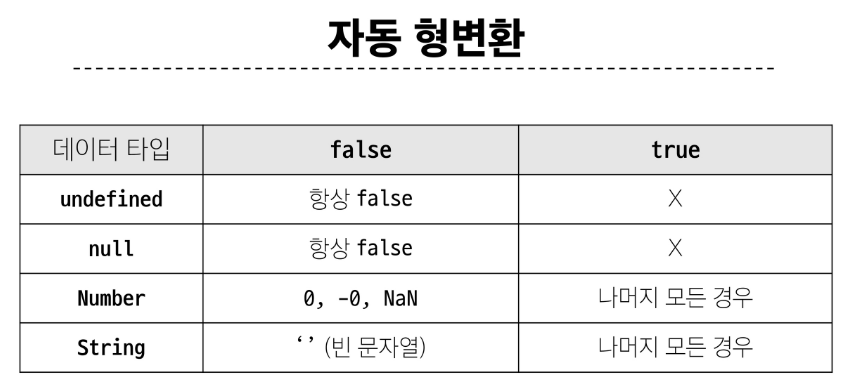

## 데이터 타입
### 원시 자료형(Primitive type) - 변수에 값이 직접 저장되는 자료형(불변, 값이 복사)
- Number : **정수 또는 실수형** 숫자를 표현하는 자료형 (NaN : Not a Number - 연산이 안되는 경우 ex.문자 + 숫자)
- String : 텍스트 데이터를 표현하는 자료형
- Boolean, null, undefined
- 변수에 할당될 때 값이 복사됨
  - 변수 간에 서로 영향을 미치지 않음
#### String
```javascript
  const age = 100
  const message = `홍길동은 ${age}세 입니다.`
```
#### 템플릿 리터럴
- 내장된 표현식을 허용하는 문자열 작성 방식
- backtick을 이용하며, 여러 줄에 걸쳐 문자열을 정의할 수도 있고 js의 변수를 문자열 안에 바로 연결할 수 있음
- 표현식은 $와 중괄호로 표기
- ES6+ 부터 지원
```javascript

```

#### null과 undefined
- null : 프로그래머가 의도적으로 값이 없음을 나타낼 때 사용
- undefined : 시스템이나 javascript 엔진이 값이 할당되지 않음을 나타낼 때 사용


#### Boolean
- 조건문 또는 반복문에서 Boolean이 아닌 데이터 타입은 자동 형변환 규칙에 따라 true / false로 변환됨


### 참조 자료형(Reference type) - 객체의 주소가 저장되는 자료형(가변, 주소가 저장)
- Objects (Object, Array, Function)
- 객체를 생성하면 객체의 메모리 주소를 변수에 할당
  - 변수 간에 서로 영향을 미침


## 연산자
### 할당 연산자
- 오른쪽에 있는 피연산자의 평가 결과를 왼쪽 피연산자에 할당하는 연산자
```javascript
  let a = 0
  a += 10
  a -= 3
  a *= 10
  a %= 7
```