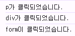

## event : 무언가 일어났다는 신호, 사건
- 모든 DOM 요소는 이러한 event를 만들어 냄
- DOM 요소에서 event가 발생하면 해당 event는 연결된 이벤트 처리기(event handler)에 의해 처리 됨


## event handler
- 특정 이벤트가 발생했을 때 실행되는 함수
- 사용자의 행동에 어떻게 반응할지를 Javascript 코드로 표현한 것

### .addEventListener() : 대표적인 이벤트 핸들러 중 하나
- 특정 이벤트를 DOM 요소가 수신할 때마다 콜백 함수를 호출

```Javascript
// 대상에 특정 이벤트가 발생하면, 지정한 이벤트를 받아 할 일을 등록한다.
EventTarget(DOM 요소).addEventListener(type(수신할 이벤트), handler(콜백함수))
```
- type
  - 수신할 이벤트 이름
  - 문자열로 작성(ex. click)
- handler
  - 발생한 이벤트 객체를 수신하는 콜백 함수
  - 이벤트 핸들러는 자동으로 event 객체를 매개변수로 받음


### addEventListener의 콜백 함수 특징
- 이벤트 핸들러 내부의 this는 이벤트 리스너에 연결된 요소(currentTartget)를 가리킴
- 이벤트가 발생하면 event 객체가 생성되어 첫번째 인자로 전달
  - 이벤트 객체가 필요 없는 경우 생략 가능
- 반환 값 없음


## 버블링(Bubbling)
- form > div > p 형태의 중첩된 구조에 각각 이벤트 핸들러가 연결되어 있을 때 만약 p 요소를 클릭하면 어떻게 될까?
```javascript
<script>
    const formElement = document.querySelector('#form')
    const divElement = document.querySelector('#div')
    const pElement = document.querySelector('#p')

    const clickHandler1 = function (event) {
      console.log('form이 클릭되었습니다.')
    }
    const clickHandler2 = function (event) {
      console.log('div가 클릭되었습니다.')
    }
    const clickHandler3 = function (event) {
      console.log('p가 클릭되었습니다.')
    }

    formElement.addEventListener('click', clickHandler1)
    divElement.addEventListener('click', clickHandler2)
    pElement.addEventListener('click', clickHandler3)
</script>
```
>
> - 한 요소에 이벤트가 발생하면, 이 요소에 할당된 핸들러가 동작하고, 이어서 부모 요소의 핸들러가 동작하는 현상
> - 가장 최상단의 조상 요소(document)를 만날 때까지 이 과정이 반복되면서 요소 각각에 할당된 핸들러가 동작
> - 이벤트가 제일 깊은 곳에 있는 요소에서 시작해 부모 요소를 거슬러 올라가며 발생하는 것이 마치 물속 거품과 닮았기 때문
> - 최하위의 p 요소를 클릭하면 p - div - form 순서로 3개의 이벤트 핸들러가 모두 순차적으로 동작했던 것

----